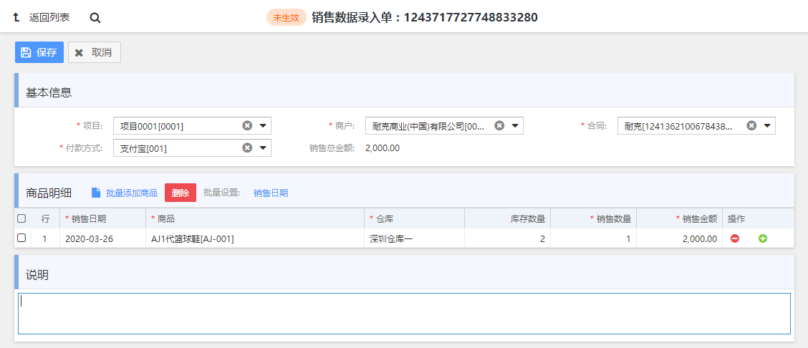

# mini-mall-web

`mini-mall-web`是`mini-mall`项目的前端工程，主要采取Extjs技术框架搭建（Extjs官网：https://www.sencha.com/products/extjs ）。那么……为什么不是Vue.js，为什么不是React等等主流的前端框架，因为……我不会（You can, You up）。所以个人觉得如果是对Extjs这个技术框架一点都不了解的，也就别研究这个前端工程的代码了（当然，如果是有了解过一点Extjs技术框架，并且目前这个技术对自己有用的话，可以瞧瞧看看，我保证整个代码框架肯定值得借鉴），想看界面的话，直接看截图就好了。

# 1. 前端工程代码结构

```
mini-mall-web
├── account	账务微服务
	├── main		主入口，当前微服务下所有模块的菜单
	├── statement	账单模块
	├── subject		科目模块
├── invest	招商微服务
	├── biztype		业态模块
	├── brand		品牌模块
	├── building	楼宇模块
	├── contract	合同模块
	├── floor		楼层模块
	├── main		主入口，当前微服务下所有模块的菜单
	├── position	铺位模块
	├── settledetail 结算明细模块
	├── store		项目模块
	├── tenant		商户模块
├── product	商品微服务
	├── goods		商品模块
		├── inbound	商品入库单模块
	├── main		主入口，当前微服务下所有模块的菜单
├── sales	销售微服务
	├── main		主入口，当前微服务下所有模块的菜单
	├── paymenttype	付款方式模块
	├── salesinput	销售数据录入单模块
```

# 2. 部分模块界面截图

## 2.1 合同模块

（1）搜索界面


（2）新建界面


（3）查看界面


## 2.2 结算明细模块


## 2.3 销售数据录入单模块

（1）搜索界面


（2）编辑界面



（3）查看界面


## 2.4 账单模块

（1）搜索界面


（2）查看界面


# 3. 搭建开发环境

## 3.1 搭建服务端环境

见[mini-mall-doc](https://github.com/Anbang713/mini-mall-doc)相关文档

## 3.2 IDEA集成sencha插件开发Extjs应用程序

见博客：https://blog.csdn.net/Anbang713/article/details/88088018

## 3.3 配置nginx代理

```
server {
	listen       80;
	server_name  api.mall.com;

	proxy_set_header X-Forwarded-Host $host;
	proxy_set_header X-Forwarded-Server $host;
	proxy_set_header X-Forwarded-For $proxy_add_x_forwarded_for;
	proxy_set_header Host $host;

	location / {
		proxy_pass http://127.0.0.1:9015; #将请求转发到网关
		proxy_connect_timeout 600;
		proxy_read_timeout 600;
	}
}
	
server {
    listen       80;
    server_name  manage.mall.com;

	#配置跨域
	add_header Access-Control-Allow-Origin *;
	add_header Access-Control-Allow-Headers X-Requested-With;
	add_header Access-Control-Allow-Methods GET,POST,OPTIONS;

	location / {
		root F:/workspace/mini-mall-web; # 前端工程的根路径
		autoindex on;
	}
}
```

## 3.4 参考3.2中的博客，在对应的工程执行sencha命令

```
# 比如编译招商微服务，则进入到invest，执行sencha app watch
F:/workspace/mini-mall-web/invest>sencha app watch

## 如果最后执行结果是这样，则表示编译成功。
[INF] Application available at http://localhost:1841
[INF] Appending content to F:\workspace\mini-mall-web-test\invest\bootstrap.js
[INF] Writing content to F:\workspace\mini-mall-web-test\invest\bootstrap.json
[INF] Application available at http://localhost:1841
[INF] Loading Build Environment
[INF] Waiting for changes...
```

## 3.5 此时浏览器访问http://manage.mall.com即可

